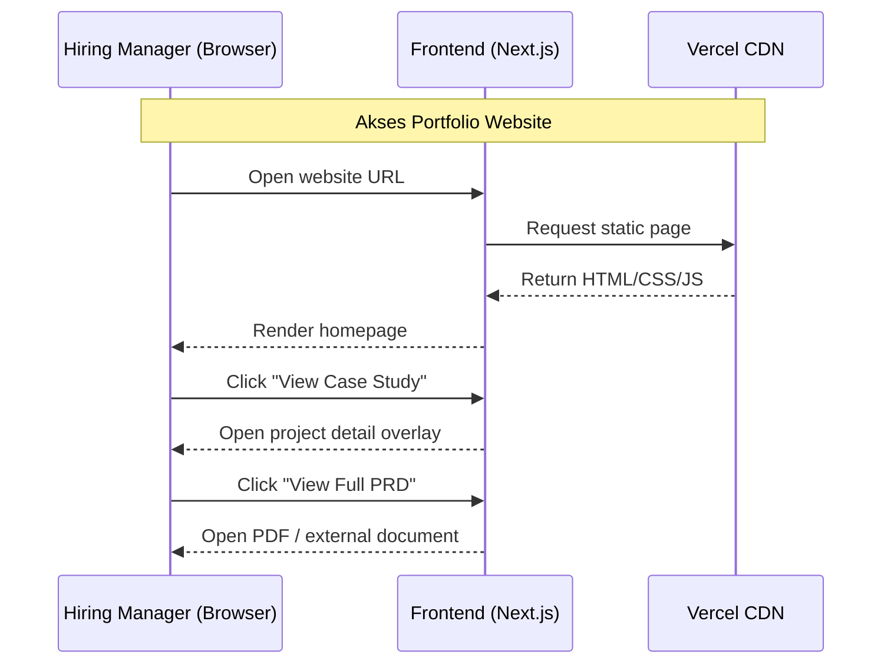
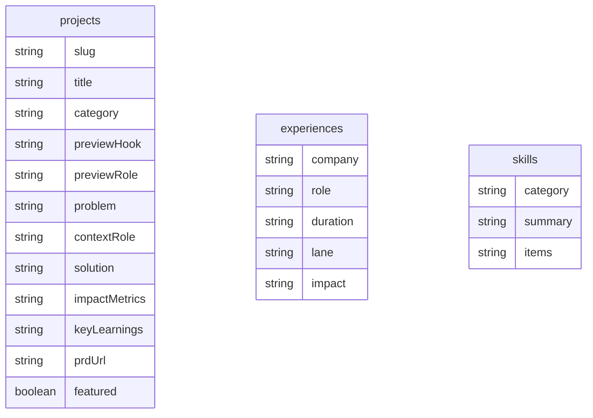

# PRD - Personal Portfolio Website

---

## 1. Overview

Website ini bertujuan untuk membangun platform personal branding berbasis web yang mendukung proses job application ke berbagai role seperti Product Manager, Business / Consultant, dan Technical roles.

Masalah utama yang ingin diselesaikan:

- Kandidat dengan skill beragam sering terlihat tidak fokus atau terlalu general.
- Hiring manager kesulitan memahami:
  - Capability utama kandidat
  - Dampak kerja
  - Cara berpikir kandidat

Tujuan utama:

- Menyediakan website yang:
  - Scannable dalam kurang dari 30 detik
  - Menunjukkan structured thinking
  - Menyediakan bukti nyata seperti PRD, metrics, dan artifacts

Website ini harus berfungsi sebagai decision-support tool untuk hiring manager: ringkas di permukaan, tetapi cukup dalam saat visitor memilih untuk melihat lebih lanjut.

---

## 2. Requirements

Persyaratan tingkat tinggi:

- Aksesibilitas:
  - Website harus dapat diakses melalui browser
  - Responsive di desktop dan mobile
- User Target:
  - HR
  - Hiring Manager
  - Cross-functional interviewer untuk role PM, Tech, dan Business
- Content Strategy:
  - Harus menggunakan struktur summary-first
  - Detail panjang dan supporting document hanya muncul sebagai layer kedua
- Portfolio Structure:
  - Harus dikategorikan menjadi:
    - Product
    - Business / Strategy
    - Technical
- Performance:
  - Load time target kurang dari 2 detik
- Maintenance:
  - Static content
  - Tidak memerlukan CMS

---

## 3. Core Features

Fitur utama MVP:

### 1. Homepage

- Hero Section:
  - Nama
  - Positioning statement
  - CTA:
    - View My Work
    - Contact Me
- Section "What I Do":
  - Product Management
  - Business / Strategy
  - Technical / Engineering
- Selected Work:
  - 2-4 highlighted projects
  - Setiap project menampilkan signal yang langsung terlihat:
    - Title
    - Category
    - Short problem / hook
    - Role / context
    - 1-2 impact metrics
- Skills Section:
  - Product
  - Data / Analytics
  - Technical
- Experience Timeline (Light):
  - Company
  - Role
  - Impact singkat

### 2. Portfolio / Case Studies

- Project tidak harus menggunakan dedicated page terpisah.
- Detail project ditampilkan melalui interaction-based detail layer agar homepage tetap compact.
- Visitor melihat summary terlebih dahulu, lalu melakukan action untuk membuka detail lebih dalam.

Struktur setiap project:

- Problem
- Context / Role
- Solution / Approach
- Impact (metrics)
- Key Learnings

Supporting feature:

- CTA: "View Full PRD"
- Mengarah ke PDF atau document eksternal / static file

### 3. Resume Section

- View Resume
- Download Resume

### 4. Contact Section

- Email sebagai primary contact
- LinkedIn redirect

---

## 4. User Flow

Alur penggunaan utama:

1. User membuka website
2. User melihat Hero dan positioning
3. User scroll ke:
   - What I Do
   - Selected Work
4. User membaca project preview langsung di homepage
5. User klik action seperti "View Case Study" atau area project card
6. Website membuka project detail overlay:
   - Dialog di desktop
   - Drawer / sheet di mobile
7. User membaca summary detail project
8. Optional: user klik "View Full PRD"
9. User menuju Contact, email, atau LinkedIn

---

## 5. Architecture

### Product / Route Structure

- Public experience utama berada di route `/`
- State project dapat di-deep-link dengan query parameter seperti `?project=<slug>`
- Tidak ada database backend
- Tidak ada CMS

### Interaction Flow

---

## 6. Database Schema

Karena menggunakan static site:

- Tidak ada database backend

Namun, struktur data internal direpresentasikan sebagai content model statis:

---

## 7. Design & Technical Constraints

### 1. High-Level Technology

- Framework: Next.js
- Styling: Tailwind CSS
- Component System: shadcn-style components
- Hosting: Vercel
- Rendering: Static Site Generation (SSG)

### 2. Design Principles

- Dark modern-minimal aesthetic
- Clean layout
- Strong visual hierarchy
- Compact but engaging content presentation
- Scan-first UX

### 3. Typography Rules

- Sans (Primary): `Inter, ui-sans-serif, system-ui, -apple-system, sans-serif`
- Serif (Optional): `Georgia, serif`
- Mono (Technical Only): `JetBrains Mono, monospace`

### 4. UX Constraints

- Informasi utama harus terlihat dalam:
  - 5 detik untuk positioning
  - 30 detik untuk value
- Tidak boleh:
  - Overload informasi
  - Embed PDF langsung di atas
  - Menampilkan semua detail project secara penuh di homepage
- Detail project harus:
  - Terlihat menarik di preview state
  - Membutuhkan user action untuk membuka layer detail

### 5. Performance Constraints

- Load time target kurang dari 2 detik
- Fully responsive
- Mobile-first

---

## Closing Note

Produk ini bukan sekadar website, tetapi decision-support tool untuk hiring manager.

Keberhasilan ditentukan oleh:

- Kejelasan positioning
- Kekuatan storytelling pada case study
- Bukti nyata melalui metrics dan PRD

---

## Next Step (Optional)

Jika ingin lanjut, pengembangan berikutnya dapat mencakup:

1. Finalisasi real content berdasarkan worksheet
2. Penggantian placeholder resume dan PRD
3. Penyempurnaan copywriting untuk role-specific application
